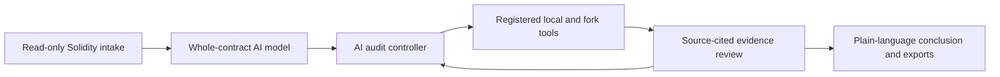

# Attest

> AI decides what matters. Proven tools produce the evidence.

Attest is a local, browser-based Solidity audit workbench built from an empty
repository for a hackathon. It uses Codex as the audit controller: first to
understand the whole contract, then to choose pertinent checks, interpret their
evidence, and deliver a plain-language conclusion.

This project was built entirely through human-directed vibe coding. The human
defined the product, security expectations, and acceptance criteria; Codex
generated and iterated the application code, tests, documentation, and
debugging instrumentation through natural-language collaboration.

## MVP status

Attest is a working hackathon MVP, not a finished commercial product. The scope
was deliberately concentrated on proving the hardest and most valuable part:
AI can understand a contract, direct real security tooling, challenge the
resulting evidence, and return a useful conclusion through one coherent
workflow.

This is more than a concept or interface mockup. The core audit engine runs,
the safety boundaries are enforced, and the workflow is backed by an extensive
regression suite. Product polish, managed tool installation, broader adapters,
packaging, and hosted-scale infrastructure are the next layer—not prerequisites
for validating the model.

## The problem

Solidity developers can run scanners, but scanner output is not an audit. A long
list of detector hits does not explain whether funds are at risk, whether owner
behavior is intentionally trusted, or which properties are actually worth
testing for a particular contract.

Attest treats AI like the coordinating auditor and security tools like its
evidence laboratory. The result is not “run every tool and print everything.”
It is a source-first investigation that can order stronger checks only when they
help answer a material question.

## Three audit levels

| Level | What Attest does | Best for |
| --- | --- | --- |
| **AI review** | Traces source, assets, roles, trust boundaries, and material logic; returns a scoped opinion without execution. | Fast review and clean contracts |
| **Targeted verification** | Adds only the analyzer, compiler, Foundry, Anvil, or fork evidence the AI considers pertinent. | Blocker and funds-safety assurance |
| **Full audit suite** | Pursues broad contract-specific unit, fuzz, invariant, deployment, analyzer, compiler, and fork coverage where applicable. | Deeper pre-release review |

The chosen level controls depth, not an arbitrary number of tests. A small clean
contract may need very little execution; a complex contract can require many
AI-designed checks.

## What the hackathon build can do

- Load or paste a single `.sol` file as an immutable audit copy.
- Sign in with a ChatGPT account through the official Codex app-server flow.
- Model the contract before testing: assets, roles, privileged paths,
  integrations, invariants, and trust assumptions.
- Let one typed AI controller select operations from a closed server-owned tool
  registry. The model cannot supply shell commands, RPC URLs, private keys,
  arbitrary calldata, or replacement Solidity.
- Run Slither and checksum-pinned Aderyn, with Solhint kept separate as code
  quality evidence rather than inflated security findings.
- Compile with Foundry, exercise disposable Foundry unit/fuzz/invariant tests,
  and compare compatible compiler versions.
- Deploy eligible contracts to a fresh loopback-only Anvil chain, including
  validated primitive constructor arguments, then verify receipts, runtime
  bytecode, and typed ABI scenarios.
- Run read-only, block-pinned fork checks against built-in public Ethereum,
  Base, and BNB profiles without signing or broadcasting.
- Cross-check source reasoning, analyzer output, generated tests, and runtime
  observations before presenting a finding.
- Show one live audit dialogue with real tool activity, AI conclusions,
  limitations, and a fixed progress dock.
- Publish concise `findings.md` plus full `evidence.json` and `worklog.json`
  provenance only after testing closes.

Mythril, Echidna, Halmos, and compiler-native SMTChecker are documented in the
tool roadmap but do not yet have active execution adapters. Attest reports that
boundary instead of implying they ran.

## How it works



Submitted source is copied once, made read-only, and checked byte-for-byte and
by SHA-256 around external execution and report publication. Generated harnesses
must import and instantiate the submitted `Target.sol`; substitute contracts are
rejected. Failed harnesses receive at most one materially corrected retry before
the limitation is recorded and the audit moves on.

## Quick start

### Requirements

- WSL
- Node.js 22+
- Foundry (`forge`, `anvil`, and a compatible cached or installable `solc`)
- Slither
- A ChatGPT account for AI review

### Install and run

```bash
npm ci --ignore-scripts
npm run deps:audit
npm run tools:install-aderyn
npm run check
npm run launch
```

`npm run launch` starts the loopback-only service and opens its private local
session once. For manual startup, use `npm start`, then open
`http://127.0.0.1:8787/`.

Use [`samples/SmokeCounter.sol`](samples/SmokeCounter.sol) for the fastest
end-to-end smoke test. [`samples/VulnerableVault.sol`](samples/VulnerableVault.sol)
demonstrates a deliberately vulnerable review target.

## Validation

The repository includes 41 Node test entrypoints covering the AI schemas,
controller lifecycle, tool adapters, source integrity, Anvil and fork controls,
authentication recovery, report gating, and browser presentation.

```bash
npm run check
npm audit --offline --audit-level=high
```

At hackathon handoff, all 41 test files pass and the offline npm audit reports
zero known vulnerabilities.

## Safety and scope

Attest never broadcasts an external-chain transaction and never reads a wallet.
Local deployment is opt-in and uses disposable Anvil accounts. Public RPC
providers can observe requested chain data and timing.

This is a hardened local, single-user hackathon release—not a hosted multi-user
security boundary and not a substitute for an independent human audit. A hosted
version would require tenant isolation, sandboxed workers, quotas, managed
secrets, abuse controls, and external security review.

## Hackathon story and documentation

- [How this was vibe-coded](docs/HACKATHON.md)
- [Condensed build log](docs/BUILD_LOG.md)
- [Architecture and security boundary](docs/ARCHITECTURE.md)
- [Tool-suite decisions](docs/TOOL_SUITE.md)
- [Dependency gate](docs/DEPENDENCIES.md)
- [Desktop application roadmap](docs/ROADMAP.md)
